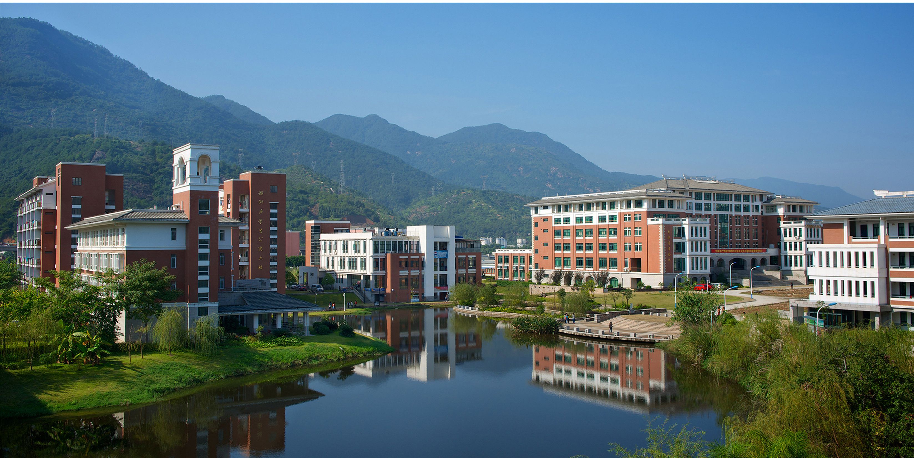

+++
title = "About Us"
description = "About Hwa Nan Alumnae Inc"
keywords = ["About Us"]
+++

**Hwa Nan Women’s College** in Fuzhou, China was founded by the Methodist Episcopal Church in US. It’s unique history, dating back to 1890 when Lydia Trimble started teaching girls in the villages of Fuzhou. When she discovered only Chinese boys received formal education, she devoted herself to the education of women for the next 50 years of her career. She established the first women’s college in southern China in 1908. The college was renamed Hwa Nan College in 1916 and received a provisional charter from the University of the State of New York in 1922. She established Hwa Nan as a four-year college, graduating its first class in 1921. The college faced many challenges during the Second Sino-Japanese War and the Chinese Civil War, and was eventually merged with other colleges to form the Fujian National University in 1949. However, the alumnae of Hwa Nan College around the world never gave up their dream of restoring their alma mater. They raised funds and re-established the Fujian Hwa Nan Women’s College in 1984. The college is officially recognized by the Fujian government and its first president was Dr. Yu Bao sheng, a former professor who had taught chemistry at the old Hwa Nan. Following its motto “Having received I ought to give”, the new Fujian Hwa Nan Women’s College made history as the first private women’s college in the People’s Republic of China.

Formed in 1983 by former Hwa Nan College alumnae and faculty from China residing in the US, **Hwa Nan Alumnae Inc.** is a US 501©(3) Nonprofit charity that aims to advance the education and empowerment of women globally. The organization supports the growth of Hwa Nan Women’s College in China and offers scholarships, grants, and exchange programs for Hwa Nan students and faculty, as well as opportunities for alumnae to connect.

For a more comprehensive view of our history, please visit our [**history page**](/history/) where Gordon M. Trimble, a contributor of Hwa Nan and a descendant of the Trimble Family who funded us, shares his story.

