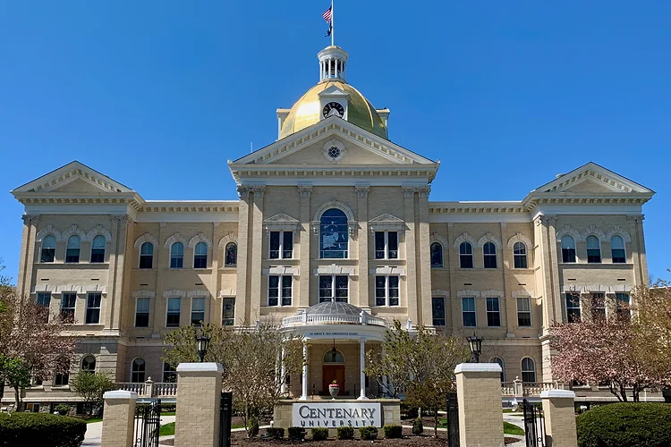

+++
title = "Centenary University"
categories = ["study-abroad"]
summary = "Exchanges Program at Centenary University"
description = "Exchanges Program at Centenary University"
keywords = ["Centenary"]
banner = "study-abroad/centenary/centenary_univ.webp"
+++

* In 2000, Hwa Nan Women’s College and Centenary University, Hackettstown, New Jersey, USA entered into agreement to allow Hwa Nan graduates to continue education at Centenary University for a BA Degree in one year.

* To be qualified to make applications to Centenary, applicants must take TOEFL or IELTS with minimum scores of 75 for TOEFL or 5 for IELTS. Candidates are eligible for a scholarship for dormitory and food expenses.

* Since 2000, around 23 Hwa Nan graduates have graduated from Centenary University with BA Degrees. Many of them have continued to study for Master or Ph. D Degrees. Currently four Hwa Nan graduates are studying at Centenary University.

