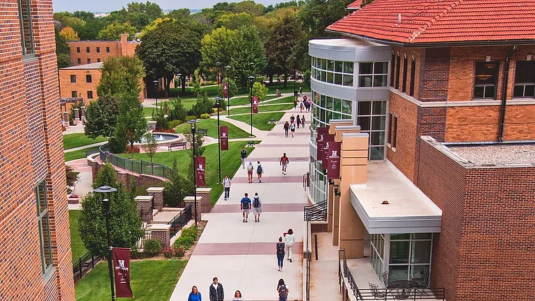

+++
title = "Morningside College"
categories = ["study-abroad"]
summary = "Exchanges Program at Morningside College"
description = "Exchanges Program at Morningside College"
keywords = ["Morningside"]
banner = "study-abroad/morningside/morningside_college.webp"
+++

* Morningside College founded in 1894 is a private, co-eduational institution in Sioux City, Iowa, USA. Lydia Trimble, founder and the first president of Hwa Nan College graduated from Morningside in 1904. Dr. Ida Belle Lewis and Lucy Wang, the second and the third president of Hwa Nan Collge also graduated from Morningside College in 1909 and 1921 respectively.

* A cooperative program is established in May 2008, which allows Hwa Nan graduates to enroll in a specially designed program leading to a BA degree from Morningside College.

* Since Year 2009, thirteen Hwa Nan graduates have successfully achieved BA degrees at Morningside College. Every summer, Hwa Nan Women’s College hosts one Morningside College faculty member as well as two students for a six week educational exchange. Lin Ben Chun, former President of Hwa Nan, visited Morningside College in 2012 and received an honorary Ph.D. degree from Morningside College.

