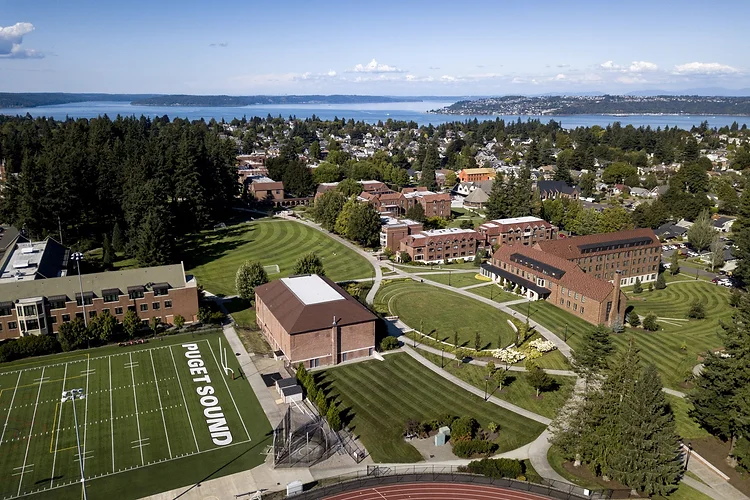

+++
title = "University of Puget Sound"
categories = ["study-abroad"]
summary = "Exchanges Program at University of Puget Sound"
description = "Exchanges Program at University of Puget Sound"
keywords = ["University of Puget Sound"]
banner = "study-abroad/puget-sound/pugetsound.webp"
+++

* The University of Puget Sound is a highly selective American liberal arts college in Tacoma, Washington. The Puget Sound campus is home to 2,600 undergraduate students and its impressive resources range from an accomplished and passionate faculty to a diverse and academically committed student body.

* The Asian Studies Department at Puget Sound grants a biennial fellowship, funded by the Trimble family that provides the opportunity for a female Puget Sound graduate to live and teach in China. Hwa Nan Women's College has warmly welcomed 14 graduates from Puget Sound University teaching in the college since 1994.

* Puget Sound has also established a unique program to promote firsthand learning experiences for its undergraduate students in Asia. Started in the early 1970s, the Pacific Rim/Asia Study-Travel Program (Pac-Rim) currently takes place once every three years. A group of 20 to 30 students are selected two years before the trip begins to give them ample time to prepare for their year of studies in various Asian countries. Hwa Nan is delighted to host the most recent (2008 and 2011) Pac-Rim groups during their travels in China. Both Hwa Nan and Puget Sound students greatly benefited from the inter-cultural interactions of this program. 
